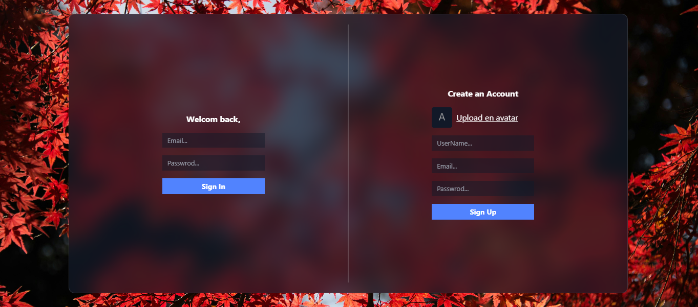
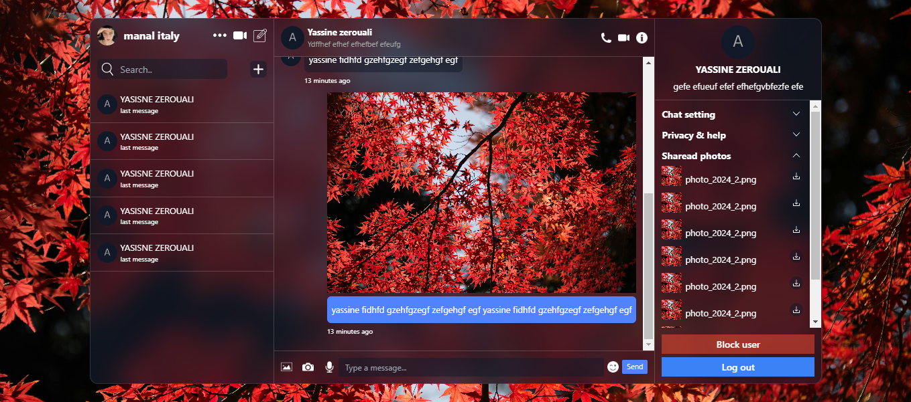
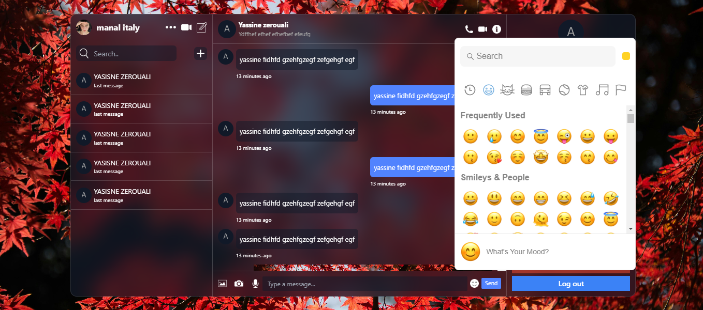
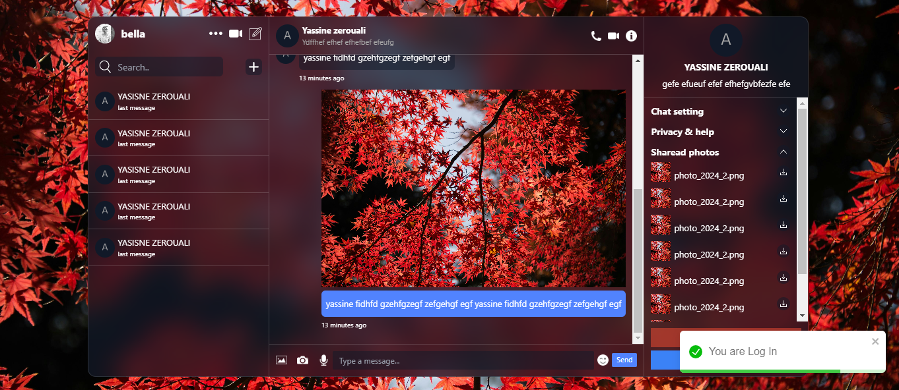

# Chat Application

This is a React-based chat application that supports user authentication and real-time messaging. It uses Firebase for authentication and Firestore for database management. The application features a chat interface, user list, and user details.

## Screenshot







## Table of Contents

- [Installation](#installation)
- [Usage](#usage)
- [Components](#components)
- [Context](#context)
- [Configuration](#configuration)
- [Styling](#styling)
- [Dependencies](#dependencies)


## Technologies Used

- **React**
- **Firebase**
- **React-toastify**
- **Context API**
- **React Icons**
- **CSS (Tailwind CSS)**

## Installation


1To get started with this project, follow these steps:

1. Clone the repository to your local machine:

   ```bash
   git clone https://github.com/0uali-Yassine/chat-app.git

2. Navigate to the project directory:
    ```bash
    cd chat-app

3. Install dependencies:
    ```bash
    npm install

4. Set up environment variables:
    -Create a .env file in the root directory.
    -Add your Spoonacular API key to the .env file
    ```bash
    REACT_APP_FIREBASE_API_KEY=your_api_key
    REACT_APP_FIREBASE_AUTH_DOMAIN=your_auth_domain
    REACT_APP_FIREBASE_PROJECT_ID=your_project_id
    REACT_APP_FIREBASE_STORAGE_BUCKET=your_storage_bucket
    REACT_APP_FIREBASE_MESSAGING_SENDER_ID=your_messaging_sender_id
    REACT_APP_FIREBASE_APP_ID=your_app_id


5. Start the development server:
    ```bash
    npm start
6. Open your browser and visit http://localhost:3000 to view the Recipe App.


## Usage

Once the server is running, you can access the application at [http://localhost:3000](http://localhost:3000). The main components of the application include:


## Components

The main components of the application include:


- **Login**: Authentication component for user login.
- **Chat**: Main chat interface.
- **List**: User list and chat list.
- **Details**: User details and settings.

## Context

The main contexts used in the application include:

- **AuthContext**: Manages user authentication state.
- **ChatContext**: Manages chat state and interactions.
- **UserContext**: Manages user data and interactions.


## Configuration

Configuration settings for the application include:

- **Server Configuration**: Settings related to the server, such as port and environment variables.
- **Database Configuration**: Settings related to the database connection.
- **Authentication Configuration**: Settings for authentication mechanisms.

## Styling

Styling guidelines and approaches used in the application include:

- **Tailwindcss**: Details about the CSS framework used, if any.
- **Custom Styles**: Information about custom stylesheets and their organization.
- **Responsive Design**: Considerations and techniques for ensuring responsiveness across devices.

## Dependencies

This section outlines the dependencies required for running the application. It includes:

- **Frontend Dependencies**: Libraries and frameworks used on the client-side.
- **Development Dependencies**: Tools and packages used during development, such as testing frameworks, build tools, etc.


## Credits

This project was created by [0uali-Yassine].

